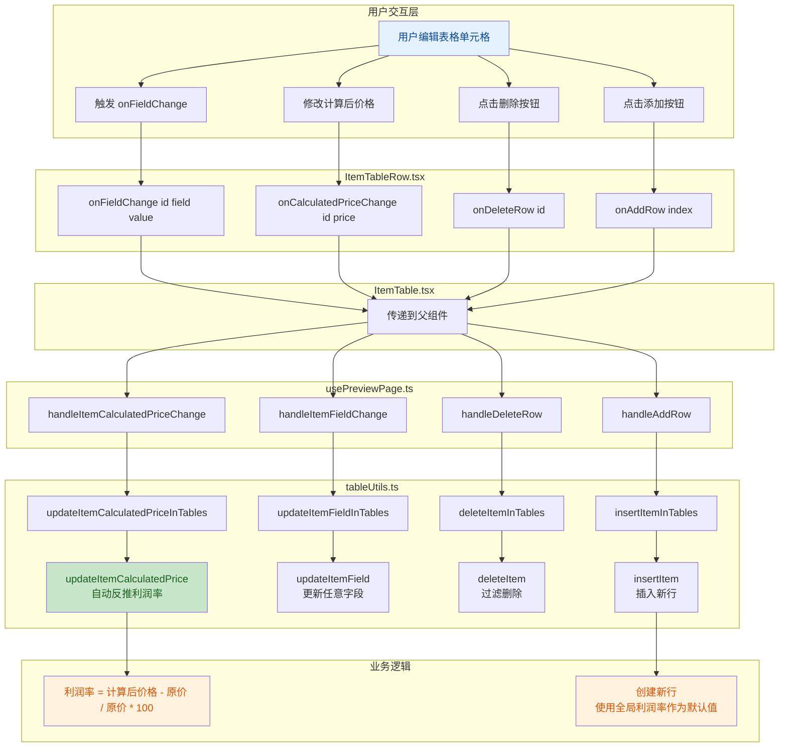

## 1. 高层摘要 (TL;DR)

*   **影响:** 🟡 **中等** - 为预览页面的表格添加了完整的行编辑、添加和删除功能,提升了用户体验和数据操作灵活性
*   **关键变更:**
    *   ✅ 将所有表格单元格从只读文本转换为可编辑的输入框
    *   ✅ 新增表格行的添加和删除功能
    *   ✅ 实现计算后价格的双向绑定(修改价格自动反推利润率)
    *   ✅ 添加操作列,包含添加(+)和删除(🗑️)按钮

---

## 2. 可视化概览 (代码与逻辑映射)



---

## 3. 详细变更分析

### 📊 组件: `ItemTable.tsx`

**变更内容:**
*   在 `ItemTableProps` 接口中新增4个回调函数属性:
    *   `onCalculatedPriceChange` - 处理计算后价格变更
    *   `onFieldChange` - 处理任意字段变更
    *   `onDeleteRow` - 处理行删除
    *   `onAddRow` - 处理行添加
*   在表格头部新增"操作"列 (宽度 w-20)
*   将所有新增的回调函数传递给 `ItemTableRow` 组件

---

### 📝 组件: `ItemTableRow.tsx`

**变更内容:**
*   **导入新组件:** 引入 `Button`、`Trash2` 和 `Plus` 图标
*   **单元格可编辑化:** 将所有只读单元格转换为 `Input` 组件:
    *   `spec` (规格) - 文本输入
    *   `ruleName` (规则名称) - 文本输入
    *   自定义字段 - 动态文本输入
    *   `originalPrice` (原价) - 数字输入,保留2位小数
    *   `profitPercent` (利润率) - 数字输入,范围0-100,保留2位小数
    *   `calculatedPrice` (计算后价格) - 数字输入,保留2位小数
*   **新增操作列:** 添加两个按钮:
    *   ➕ 添加按钮 - 在当前行后插入新行
    *   🗑️ 删除按钮 - 删除当前行(红色高亮)
*   **样式优化:**
    *   所有输入框高度统一为 `h-7`
    *   隐藏数字输入框的默认微调器 (`appearance-none`)
    *   单元格内边距从 `p-2` 改为 `p-1` 以适应输入框

**关键代码片段:**
```typescript
// 计算后价格输入框 - 支持双向绑定
<Input
  type="number"
  min="0"
  step="0.01"
  value={item.calculatedPrice.toFixed(2)}
  onChange={(e) => onCalculatedPriceChange(item.id, Number(parseFloat(e.target.value).toFixed(2)))}
  className="h-7 w-20 text-right"
/>
```

---

### 🎣 Hook: `usePreviewPage.ts`

**变更内容:**
*   **新增4个处理函数:**

| 函数名 | 功能 | 关键逻辑 |
|--------|------|----------|
| `handleItemCalculatedPriceChange` | 更新计算后价格 | 调用 `updateItemCalculatedPriceInTables` |
| `handleItemFieldChange` | 更新任意字段 | 调用 `updateItemFieldInTables` |
| `handleDeleteRow` | 删除行 | 调用 `deleteItemInTables` |
| `handleAddRow` | 添加新行 | 创建新 `PriceItem`,使用全局利润率作为默认值 |

*   **新行创建逻辑:**
```typescript
const newItem: PriceItem = {
  id: `new-${Date.now()}-${Math.random().toString(36).substr(2, 9)}`,
  sheetName: currentTable.sheetName,
  tableIndex: currentTable.items.length,
  spec: "",
  ruleName: "",
  originalPrice: 0,
  profitPercent: globalProfit,  // 使用全局利润率
  calculatedPrice: 0,
  selectedForBatch: false,
  selectedForExport: false,
};
```

---

### 🛠️ 工具函数: `tableUtils.ts`

**变更内容:**
*   **新增4个表格级别函数 (操作整个 tables 数组):**

| 函数名 | 参数 | 返回值 |
|--------|------|--------|
| `updateItemCalculatedPriceInTables` | tables, sheetName, itemId, calculatedPrice | TableData[] |
| `updateItemFieldInTables` | tables, sheetName, itemId, field, value | TableData[] |
| `deleteItemInTables` | tables, sheetName, itemId | TableData[] |
| `insertItemInTables` | tables, sheetName, index, newItem | TableData[] |

*   **新增4个单表级别函数 (操作单个 TableData):**

| 函数名 | 功能 | 关键逻辑 |
|--------|------|----------|
| `updateItemCalculatedPrice` | 更新计算后价格并反推利润率 | `profitPercent = (calculatedPrice - originalPrice) / originalPrice * 100` |
| `updateItemField` | 更新任意字段 | 使用展开运算符动态更新字段 |
| `deleteItem` | 删除项目 | `items.filter(item => item.id !== itemId)` |
| `insertItem` | 插入新项目 | `items.splice(index, 0, newItem)` |

**关键业务逻辑:**
```typescript
// 计算后价格变更时,自动反推利润率
export function updateItemCalculatedPrice(
  table: TableData,
  itemId: string,
  calculatedPrice: number,
): TableData {
  return {
    ...table,
    items: table.items.map((item) =>
      item.id === itemId
        ? {
            ...item,
            calculatedPrice,
            profitPercent: item.originalPrice > 0
              ? ((calculatedPrice - item.originalPrice) / item.originalPrice) * 100
              : 0,  // 避免除以零
          }
        : item,
    ),
  };
}
```

---

### 📄 页面: `PreviewPage.tsx`

**变更内容:**
*   从 `usePreviewPage` hook 中解构出4个新的处理函数
*   将这些函数传递给 `ItemTable` 组件

---

## 4. 影响与风险评估

### ⚠️ 潜在风险

| 风险项 | 描述 | 缓解措施 |
|--------|------|----------|
| **数据一致性** | 修改计算后价格时,如果原价为0,会导致利润率计算异常 | 代码中已添加 `item.originalPrice > 0` 检查,避免除以零 |
| **输入验证** | 用户可能输入负数或非法字符 | 输入框已设置 `min="0"` 和 `type="number"` |
| **性能问题** | 频繁的输入可能导致大量状态更新 | 当前实现使用直接更新,建议考虑防抖优化 |
| **唯一ID冲突** | 新行ID生成可能存在极小概率冲突 | 使用 `Date.now()` + 随机字符串,冲突概率极低 |

### 🧪 测试建议

1.  **基础编辑功能:**
    *   ✅ 验证所有字段(规格、规则名称、原价、利润率、计算后价格)都可以正常编辑
    *   ✅ 验证数字输入框保留2位小数
    *   ✅ 验证利润率输入范围限制(0-100)

2.  **双向绑定测试:**
    *   ✅ 修改计算后价格,验证利润率自动更新
    *   ✅ 修改利润率,验证计算后价格自动更新
    *   ✅ 测试原价为0时的边界情况

3.  **行操作测试:**
    *   ✅ 点击删除按钮,验证行被正确移除
    *   ✅ 点击添加按钮,验证新行插入到正确位置
    *   ✅ 验证新行使用全局利润率作为默认值
    *   ✅ 验证新行的ID唯一性

4.  **UI/UX测试:**
    *   ✅ 验证输入框在不同主题下的可读性
    *   ✅ 验证操作按钮的悬停效果
    *   ✅ 验证表格在滚动时的布局稳定性

---

## 5. 总结

此次变更将预览页面的表格从**只读模式**升级为**完全可编辑模式**,显著提升了用户的数据操作体验。核心亮点包括:

*   🎯 **完整的CRUD支持** - 支持创建、读取、更新、删除表格行
*   🔄 **智能双向绑定** - 修改计算后价格自动反推利润率
*   🎨 **优化的UI设计** - 紧凑的输入框布局,直观的操作按钮
*   🛡️ **健壮的错误处理** - 边界条件检查(如除以零防护)

建议在合并前进行充分的端到端测试,特别是验证批量操作和导出功能与新编辑功能的兼容性。