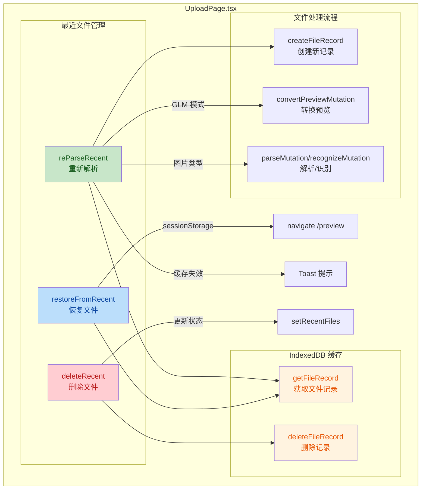
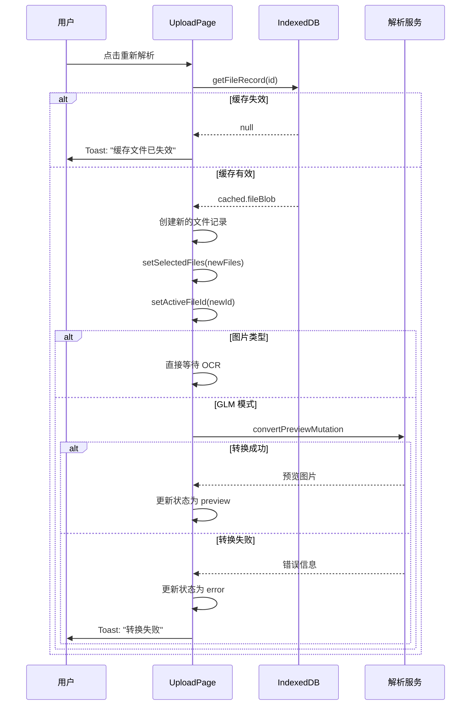

## 1. 高层摘要 (TL;DR)

- **影响**: 🟡 中等 - 增强了最近文件的管理功能，提升了用户体验
- **核心变更**:
  - ✨ 新增**删除最近文件**功能
  - ✨ 新增**重新解析最近文件**功能，支持从缓存恢复并重新处理
  - 🎨 优化最近文件列表 UI，添加操作按钮和状态高亮
  - 🛡️ 改进错误处理机制

## 2. 可视化概览 (代码与逻辑图)

## 3. 详细变更分析

### 3.1 导入与工具函数扩展

**变更内容**: 扩展了从 `@/utils/fileCache` 导入的工具函数

| 函数名 | 用途 |
|--------|------|
| `getFileRecord` | 从 IndexedDB 获取单个文件记录 |
| `deleteFileRecord` | 从 IndexedDB 删除文件记录 |

**影响**: 为新增的删除和重新解析功能提供底层支持

---

### 3.2 新增功能 - 删除最近文件

**函数**: `deleteRecent(recent: { id: string })`

**逻辑说明**:
- 调用 `deleteFileRecord` 从 IndexedDB 删除记录
- 更新 `recentFiles` 状态，过滤掉已删除的文件
- 包含错误处理，失败时输出到控制台

**代码位置**: `UploadPage.tsx` 第 610-616 行

---

### 3.3 改进功能 - 恢复最近文件

**函数**: `restoreFromRecent(recent)`

**变更点**:
- ✅ 新增 `try-catch` 错误处理
- ✅ 恢复失败时显示 Toast 提示用户重新解析

**代码位置**: `UploadPage.tsx` 第 618-655 行

---

### 3.4 新增功能 - 重新解析最近文件 ⭐

**函数**: `reParseRecent(recent)` - **核心新增功能**

**业务流程**:

**关键逻辑**:
1. **缓存验证**: 从 IndexedDB 获取原始文件 blob
2. **文件重建**: 创建新的文件 ID 和记录，避免状态冲突
3. **类型识别**: 自动识别文件类型（图片/文档）
4. **GLM 流程**: 如果启用 GLM 模式，自动执行预览转换
5. **错误处理**: 全流程错误捕获和用户提示

**代码位置**: `UploadPage.tsx` 第 657-762 行

---

### 3.5 UI 改进 - 最近文件列表

#### 布局优化

| 元素 | 旧实现 | 新实现 |
|------|--------|--------|
| 显示条件 | `selectedFiles.size === 0` | 始终显示 |
| 列表限制 | 最多显示 4 个 | 显示全部 |
| 滚动支持 | 无 | `max-h-[420px] overflow-y-auto` |
| 容器布局 | 固定高度 | `flex-1 flex flex-col overflow-hidden` |

#### 新增交互元素

**最近文件项增强**:

| 功能 | 实现 | 说明 |
|------|------|------|
| 文件计数 | `({recentFiles.length})` | 显示最近文件总数 |
| 活跃状态 | `border-blue-500 bg-blue-50 ring-2` | 当前选中文件高亮 |
| 重新解析按钮 | 刷新图标 SVG | 触发 `reParseRecent` |
| 删除按钮 | × 图标 | 触发 `deleteRecent` |
| Tooltip | `title="删除"` 等 | 鼠标悬停提示 |

**代码位置**: `UploadPage.tsx` 第 916-985 行

#### 按钮交互改进

**删除按钮优化**:
- 添加 `cursor-pointer` 类
- 添加 `title="删除"` 提示
- 代码位置: 第 902-904 行

**按钮文本优化**:
- "转换图片预览" → "转换预览"
- 代码位置: 第 1203 行

---

### 3.6 帮助文本更新

**GLM 模式说明**:

| 旧文本 | 新文本 |
|--------|--------|
| 上传Excel/PDF文件，使用GLM大模型视觉识别 | 上传Excel/Pdf/图片文件，使用大模型视觉识别 |
| 上传图片文件，OCR识别规格和原价 | 上传图片文件，点击"转换预览"按钮，转换文件内容 |
| 选择要解析的Sheet，点击开始AI识别 | 选择要解析的内容，点击"开始AI识别"按钮 |
| 识别后可在预览页面修改利润率 | 识别后可在预览页面编辑内容和导出文件 |

**代码位置**: `UploadPage.tsx` 第 1241-1244 行

---

## 4. 影响与风险评估

### ⚠️ 潜在风险

| 风险项 | 影响 | 缓解措施 |
|--------|------|----------|
| **IndexedDB 缓存失效** | 用户无法重新解析旧文件 | 已添加缓存验证和 Toast 提示 |
| **文件 blob 兼容性** | 不同浏览器 blob 处理差异 | 使用标准 File API，已做类型断言 |
| **状态冲突** | 重新解析可能与当前上传冲突 | 生成新的文件 ID，避免键冲突 |
| **内存占用** | 同时加载多个文件 blob | 已有删除功能，用户可主动清理 |

### ✅ 测试建议

1. **功能测试**:
   - ✅ 测试删除最近文件，验证 IndexedDB 记录被正确移除
   - ✅ 测试重新解析功能，验证文件能正确恢复和处理
   - ✅ 测试缓存失效场景，验证错误提示显示

2. **UI 测试**:
   - ✅ 验证最近文件列表滚动和布局
   - ✅ 验证按钮 hover 状态和 tooltip 显示
   - ✅ 验证活跃文件的高亮效果

3. **边界测试**:
   - ✅ 测试大量最近文件时的性能
   - ✅ 测试同时上传和重新解析的场景
   - ✅ 测试不同文件类型（Excel/PDF/图片）的重新解析

### 🎯 用户体验提升

- 📦 **数据持久化**: 用户可以保留历史文件记录
- 🔄 **灵活操作**: 支持直接恢复或重新解析
- 🧹 **清理能力**: 可主动删除不需要的记录
- 🎨 **视觉反馈**: 清晰的状态指示和操作按钮

---

## 5. 总结

本次变更主要增强了**最近文件管理功能**，通过添加删除和重新解析功能，让用户可以更灵活地处理历史文件。UI 方面也做了显著改进，包括滚动支持、操作按钮和状态高亮，整体提升了用户体验。代码质量方面，新增了完善的错误处理机制，降低了功能异常的风险。