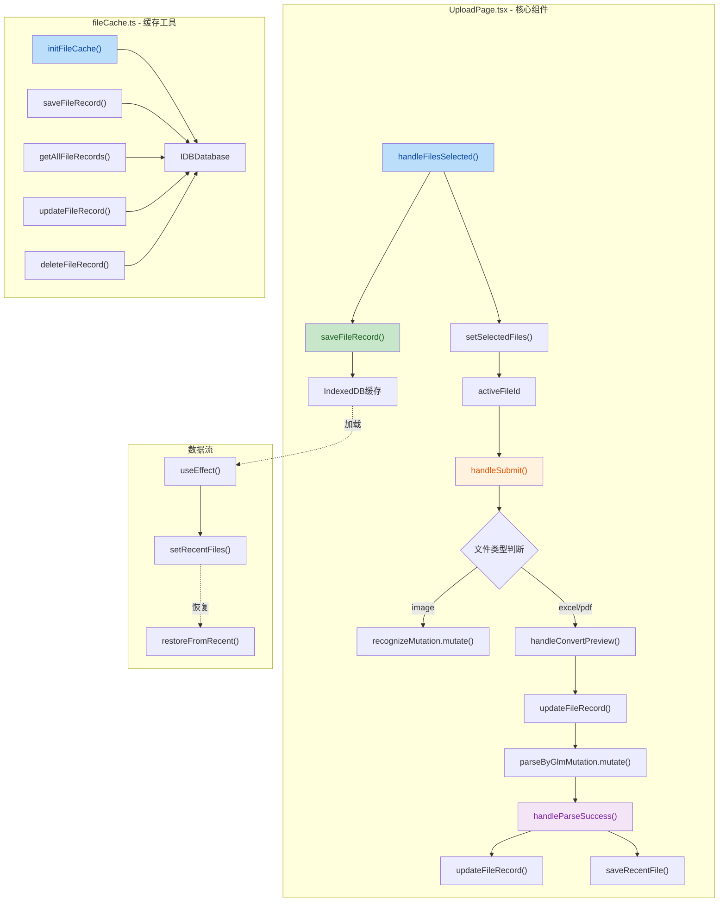
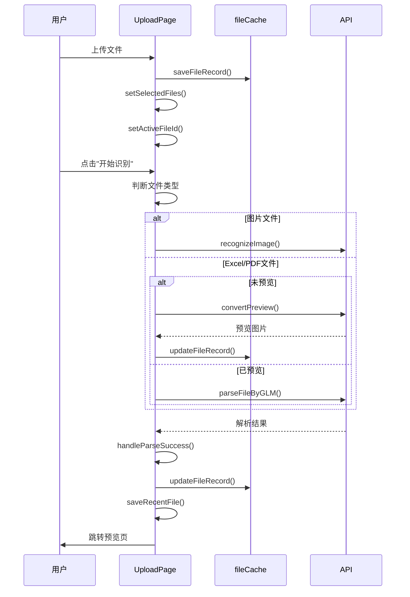

## 1. 高层摘要 (TL;DR)

**影响范围:** 🔴 **高** - 核心上传页面重构,新增缓存系统,支持多文件批量处理

**核心变更:**
- ✨ **多文件上传**: 从单文件升级为支持批量上传多个文件
- 💾 **IndexedDB缓存**: 新增文件缓存系统,持久化存储文件和解析结果
- 🎨 **UI重构**: 从单栏布局升级为三栏布局(上传区+操作区+说明区)
- 🔄 **最近文件**: 新增最近上传文件快速恢复功能
- 📝 **文档更新**: 统一将"GLM-4V-Flash"改为"GLM大模型"

---

## 2. 可视化概览 (代码与逻辑图)



---

## 3. 详细变更分析

### 📁 **新增文件: `frontend/src/utils/fileCache.ts`**

**功能描述:** 提供IndexedDB文件缓存系统,用于持久化存储上传的文件、预览图片和解析结果。

**核心功能:**

| 函数名 | 功能描述 |
|--------|----------|
| `initFileCache()` | 初始化IndexedDB数据库 |
| `saveFileRecord()` | 保存文件记录到数据库 |
| `getFileRecord()` | 根据ID获取文件记录 |
| `getAllFileRecords()` | 获取所有文件记录(按时间倒序) |
| `updateFileRecord()` | 更新文件记录 |
| `deleteFileRecord()` | 删除文件记录 |

**数据结构:**
```typescript
interface CachedFileRecord {
  id: string;
  name: string;
  fileBlob: Blob;
  fileType: 'image' | 'excel' | 'pdf';
  timestamp: number;
  parseResult: any | null;
  previewImages: { url: string; sheet_name: string; index: number }[] | null;
}
```

---

### 🎨 **核心重构: `frontend/src/pages/UploadPage.tsx`**

#### **1. 状态管理重构**

**变更类型:** 从单文件状态升级为多文件Map管理

| 旧状态 | 新状态 | 说明 |
|--------|--------|------|
| `selectedFile: File \| null` | `selectedFiles: Map<string, UploadFileRecord>` | 支持多文件 |
| `previewImages: PreviewImage[] \| null` | `UploadFileRecord.previewImages` | 每个文件独立管理 |
| `selectedSheets: Set<number>` | `UploadFileRecord.selectedSheets` | 每个文件独立管理 |
| `previewLoading: boolean` | `UploadFileRecord.status: "pending" \| "preview" \| "parsed" \| "error"` | 更细粒度的状态 |

**新增类型定义:**
```typescript
export type FileType = "image" | "excel" | "pdf";

export interface UploadFileRecord {
  id: string;
  file: File;
  fileType: FileType;
  previewUrl: string | null;
  previewImages: PreviewImage[] | null;
  selectedSheets: Set<number>;
  parseResult: ParseResponse | null;
  status: "pending" | "preview" | "parsed" | "error";
  errorMessage?: string;
}
```

#### **2. 核心函数变更**

**文件处理逻辑统一化:**

| 旧函数 | 新函数 | 变更说明 |
|--------|--------|----------|
| `validateAndSetExcelFile()` | `handleFilesSelected()` | 统一处理所有文件类型 |
| `validateAndSetImageFile()` | (合并到`handleFilesSelected`) | 不再需要单独验证 |
| `clearSelectedFile()` | `deleteFile(fileId)` / `clearAllFiles()` | 支持删除单个或全部 |

**新增功能函数:**

| 函数名 | 功能 |
|--------|------|
| `loadRecentFiles()` | 从localStorage加载最近文件 |
| `saveRecentFile()` | 保存文件到最近记录 |
| `restoreFromRecent()` | 从最近文件恢复并跳转 |
| `selectFile(fileId)` | 切换当前活动文件 |
| `resetPreview(fileId)` | 重置指定文件的预览 |

#### **3. UI布局重构**

**旧布局:** 单栏布局(上传区+使用说明)

**新布局:** 三栏布局

```
┌─────────────────────────────────────────────────────────┐
│  左侧栏 (288px)    │    中间栏 (flex-1)    │  右侧栏  │
│  ┌──────────────┐  │  ┌────────────────┐  │          │
│  │ 上传区域     │  │  │ 当前文件信息   │  │  使用说明 │
│  │ 文件列表     │  │  │ 利润率设置     │  │          │
│  │ 最近上传     │  │  │ Sheet预览      │  │          │
│  └──────────────┘  │  │ 自定义字段     │  │          │
│                    │  │ 提交按钮       │  │          │
│                    │  └────────────────┘  │          │
└─────────────────────────────────────────────────────────┘
```

**关键变更:**
- 移除了Excel/图片模式的Tab切换
- 统一上传区域支持所有文件类型
- 文件列表显示缩略图、状态标识
- 最近文件快速恢复功能

#### **4. 业务逻辑优化**

**默认值变更:**

| 配置项 | 旧值 | 新值 | 影响 |
|--------|------|------|------|
| `useGLM` | `false` | `true` | 默认开启AI解析 |

**解析流程优化:**



---

### 🐛 **UI组件优化: `frontend/src/components/ui/button.tsx`**

**变更:** 添加 `cursor-pointer` 类,确保按钮始终显示手型光标

```diff
- "inline-flex items-center justify-center whitespace-nowrap rounded-md..."
+ "cursor-pointer inline-flex items-center justify-center whitespace-nowrap rounded-md..."
```

---

### ⚙️ **配置调整: `frontend/vite.config.ts`**

**变更:** 取消注释API代理配置,确保开发环境API请求正确转发

```diff
- // target: env.VITE_API_TARGET || "http://localhost:8000",
+ target: "http://localhost:8000",
```

---

### 📝 **文档更新: 多个文件**

**统一变更:** 将"GLM-4V-Flash"改为"GLM大模型"

| 文件 | 变更位置 |
|------|----------|
| `excel_to_image.py` | 文档字符串 |
| `frontend/src/api/index.ts` | 函数注释 |
| `main.py` | API文档字符串 |
| `parse_image_glm.py` | 模块文档字符串 |

**示例:**
```diff
- 使用GLM-4V-Flash视觉API识别
+ 使用GLM大模型视觉API识别
```

---

## 4. 影响与风险评估

### ⚠️ **破坏性变更**

| 变更项 | 影响范围 | 兼容性处理 |
|--------|----------|------------|
| 单文件→多文件 | UploadPage组件状态 | ✅ 已处理 - 新增Map结构 |
| IndexedDB缓存 | 浏览器存储 | ✅ 已处理 - 降级到localStorage |
| UI布局重构 | 用户界面 | ⚠️ 需要测试 - 三栏布局响应式 |

### 🔍 **测试建议**

#### **功能测试:**
1. ✅ **多文件上传**: 测试同时上传多个不同类型文件
2. ✅ **文件切换**: 测试在文件列表中切换活动文件
3. ✅ **缓存持久化**: 刷新页面后验证文件记录是否保留
4. ✅ **最近文件**: 测试从最近文件恢复功能
5. ✅ **文件删除**: 测试删除单个文件和清空所有文件

#### **边界测试:**
1. 📂 **大文件**: 测试上传大文件(>10MB)的缓存性能
2. 📂 **多文件**: 测试同时上传10+个文件
3. 📂 **混合类型**: 测试同时上传Excel、PDF、图片
4. 📂 **网络异常**: 测试API失败时的错误处理

#### **UI测试:**
1. 🖥️ **响应式布局**: 测试不同屏幕尺寸下的三栏布局
2. 🖥️ **状态显示**: 验证文件状态(pending/preview/parsed/error)的正确显示
3. 🖥️ **缩略图**: 验证图片缩略图和文件类型图标的显示

### 📊 **性能影响**

| 指标 | 预估影响 | 说明 |
|------|----------|------|
| 首次加载 | ⚠️ 轻微增加 | IndexedDB初始化 |
| 文件上传 | ✅ 无影响 | 批量上传提升效率 |
| 内存占用 | ⚠️ 增加 | 多文件同时加载 |
| 存储空间 | ⚠️ 增加 | IndexedDB缓存文件 |

---

## 5. 总结

本次重构是一次**重大升级**,主要实现了:

1. **🚀 用户体验提升**: 多文件批量处理、最近文件快速恢复
2. **💾 数据持久化**: IndexedDB缓存系统,刷新不丢失
3. **🎨 界面优化**: 三栏布局,信息层次更清晰
4. **🔧 代码质量**: 统一文件处理逻辑,减少重复代码

**建议后续优化:**
- 考虑添加文件上传进度条
- 考虑添加文件拖拽排序功能
- 考虑添加批量删除功能
- 考虑优化IndexedDB的存储策略(如定期清理旧记录)